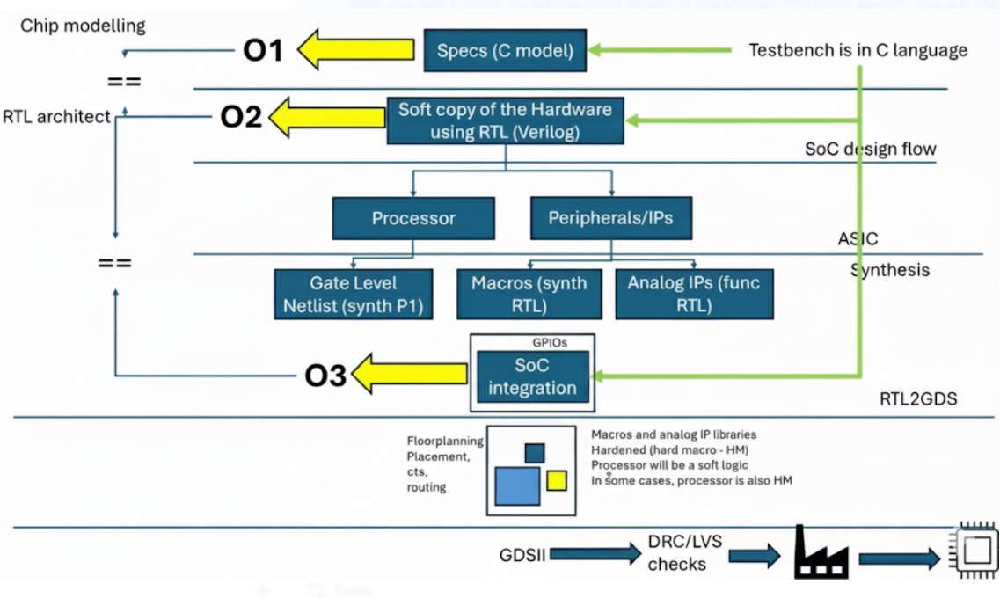
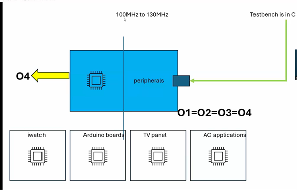

# Task1 - Overview of Digital VLSI SoC Design and Planning

This project provides a comprehensive overview of **Digital VLSI System-on-Chip (SoC) design**, covering the workflow from **high-level C modeling** to **fully verified silicon-ready GDSII layouts**. The aim is to understand the complete SoC development cycle, including design, verification, and integration of both digital and analog components.

---

### 1. **Chip Modeling (O1)**
- Starts with **C-based specifications** to describe the chip’s intended functionality.  
- A **C model** acts as a functional simulator, capturing the chip’s behavior.  
- **Testbenches in C** verify correctness and robustness of the model.  
- This stage ensures the design intent is clear before hardware-level design.

---

### 2. **RTL Architecture (O2)**
- The functional C model is converted into **Register Transfer Level (RTL)** using **Verilog or VHDL**.  
- RTL represents both **logic and timing**, serving as a blueprint for the hardware.  

**Key RTL Components:**
- **Processor Core:** RISC-V, ARM, or other CPU cores.  
- **Peripheral IPs:** UART, SPI, I2C, and other interfaces.  
- **Analog IPs in RTL:** Mixed-signal components like PLLs and ADCs are modeled functionally.  

**Synthesis Outputs:**
- **Gate-Level Netlist:** Logic-level representation of all blocks.  
- **Soft Macros:** Synthesized RTL blocks; flexible and reusable.  
- **Hard Macros:** Pre-designed, fixed layout blocks; optimized for performance.  

---

### 3. **SoC Integration (O3)**
- Combines all components into a single **System-on-Chip (SoC)**:  
  - Processor cores  
  - Peripherals  
  - Analog IPs  
  - GPIOs and interconnects  
- **Integration verification** ensures the combined RTL behaves as intended according to the C model.  

---

### 4. **Physical Design Flow (RTL → GDSII)**
- Converts RTL design into a **physical layout** ready for fabrication.

  
  

  <i>Figure 1 & 2: High-level SoC design and integration diagrams</i>

**Key Steps:**
1. **Floorplanning:** Allocate space for major functional blocks.  
2. **Placement & Routing:** Place standard cells and route interconnections.  
3. **Clock Tree Synthesis (CTS):** Distribute clock signals efficiently.  

**Verification Checks:**
- **Design Rule Check (`DRC`):** Confirms layout complies with fabrication rules.  
- **Layout vs Schematic (`LVS`):** Ensures layout matches the RTL design.  

**Outputs:**
- **GDSII File:** Final chip layout ready for manufacturing.  
- **Hard Macros:** Fixed, pre-placed IPs (e.g., memory, analog).  
- **Soft Macros:** Flexible, synthesizable RTL blocks.  

---

### 5. **Key Concepts**

| Term        | Description                                               | Example                        |
|------------|-----------------------------------------------------------|--------------------------------|
| Soft Macro | Synthesizable RTL block; flexible and modifiable         | Custom ALU, FIFO               |
| Hard Macro | Pre-designed, fixed layout block                          | SRAM block, PLL                |
| GDSII      | Physical chip layout file for fabrication                | Final layout for fab           |
| DRC        | Design rule compliance check                              | Minimum width, spacing rules   |
| LVS        | Ensures layout matches RTL functionality                 | Compare schematic vs layout    |

---

### 6. **Additional Insights**
- **System Complexity:** Modern SoCs integrate processors, memory, and multiple interfaces on a single chip.  
- **Power & Thermal Management:** Critical considerations for mobile and embedded systems.  
- **Verification & Timing Analysis:** Ensures functional correctness and timing closure.  
- **Emerging Trends:** Heterogeneous integration, AI/ML-enabled SoCs, advanced fabrication technologies, and automated design tools.  

> This workflow provides a smooth transition from **high-level functional ideas in C** to a **fully verified, manufacturable silicon chip**, combining both classical SoC design principles and modern VLSI practices.

---

### 7. **Next Steps**
- Explore timing closure and power optimization techniques.  
- Learn automated verification tools like `PrimeTime` and `Cadence Innovus`.  
- Implement a small SoC integration project for hands-on experience.  
